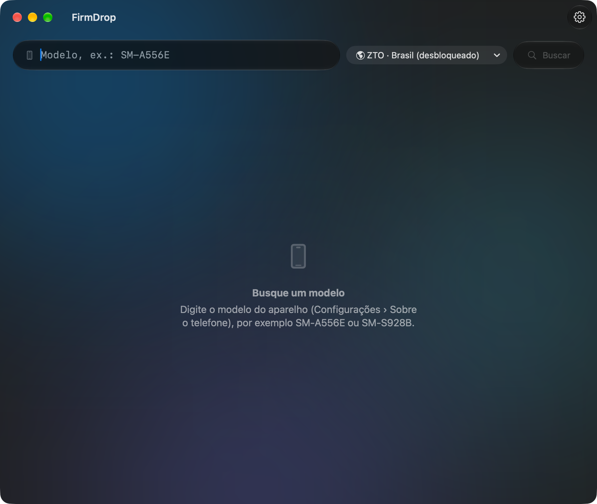

# FirmDrop — firmwares Samsung no Mac

Aplicação open source macOS para baixar firmwares oficiais da Samsung direto do servidor FUS (Firmware Update Server), com instalação experimental via USB. Os downloads são os pacotes oficiais da Samsung, sem nenhuma modificação: o app decifra o .enc4 com a chave fornecida pelo servidor. O .zip pode ser importado no FirmDrop ou utilizado com outra ferramenta de instalação.

<p align="center">
  
</p>

- Busca por modelo e região (Brasil: ZTO, Claro, TIM, Vivo, ou qualquer outro CSC)
- Mostra nome comercial, tamanho, versão do Android e versões anteriores com mês/ano
- **Não exige IMEI**
- Downloads com pausa e retomada, inclusive depois de fechar o app
- Confere o **CRC32** e decifra o `.enc4` automaticamente
- Evita que o Mac entre em repouso durante o download, avisa com notificação ao terminar
  e mostra a contagem de downloads no Dock
- Avisa quando há uma versão nova do app (Releases do GitHub)
- Em português e inglês, conforme o idioma do macOS (inglês para os demais idiomas)
- Instalação experimental de BL/AP/CP/CSC pelo motor [Brokkr](https://github.com/Gabriel2392/brokkr-flash), com USB nativo do macOS, teste de conexão, importação de ZIP e registro de progresso

Visual Liquid Glass (barras e cartões de vidro flutuantes, modo claro e escuro).
Requer **macOS 26** ou mais novo.

## Instalar

1. Baixe o `FirmDrop.dmg` da versão mais recente na [página de Releases](https://github.com/julianamarques/firmdrop/releases).
2. Abra o arquivo e arraste o **FirmDrop** para **Aplicativos**.

O app avisa quando há uma versão nova. Em **FirmDrop › Verificar Atualizações…** você verifica
na hora, e em **Ajustes › Atualizações** escolhe se a verificação é automática (ao abrir o app e
uma vez por dia) ou só manual. Quem usa uma versão estável não é avisado de pré-lançamentos
(alpha, beta, rc).

O app é assinado apenas localmente (*ad-hoc*). Em outro Mac, o macOS bloqueia a primeira
abertura: libere em **Ajustes do Sistema › Privacidade e Segurança › Abrir Mesmo Assim**.
Para distribuir sem esse aviso, é preciso assinar e notarizar com uma conta Apple Developer.

## Compilar

É preciso o Xcode 26 ou mais novo (ou as Command Line Tools com Swift 6.2+).

```sh
scripts/build-app.sh             # gera build/FirmDrop.app
scripts/build-app.sh --install   # e copia para /Applications
scripts/make-dmg.sh              # gera build/FirmDrop.dmg
```

Opção para os dois scripts: `--universal` gera um binário para Apple Silicon e Intel.

O build baixa o `auth_param.dat` uma vez (ver [abaixo](#auth_paramdat)) e o embute no app.
Também baixa o `adb` do Android SDK Platform-Tools (versão fixa, conferida por SHA-256)
e o embute com seu NOTICE.
Também compila o motor de instalação como um executável separado, usando revisões fixas
do Brokkr e de suas dependências. A primeira compilação precisa de internet e Git;
não precisa de Qt, Homebrew, Heimdall ou OdinMac. O motor e seus fontes completos
acompanham o `.app`. Veja [Engine/README.md](Engine/README.md).

Para desenvolver no Xcode, abra o `Package.swift` (`xed .`) e rode o esquema **FirmDrop**.
Rodando fora do `.app`, o app usa o `Resources/auth_param.dat`: baixe-o antes com
`scripts/fetch-auth-params.sh`.
Para testar a instalação ao executar `swift run`, compile também o motor uma vez com
`bash scripts/build-flash-engine.sh`; para o botão ADB, rode `scripts/fetch-adb.sh`.

## Traduções

Os textos ficam em português no código, e as traduções em
`Resources/Localizable.xcstrings` (String Catalog, que pode ser editado no Xcode). Depois de
adicionar ou alterar textos, rode:

```sh
scripts/sync-strings.sh   # extrai os textos do código e atualiza o catálogo
```

Os textos novos aparecem sem tradução no catálogo, e o `swift test` falha até que todos
tenham a versão em inglês, com os mesmos marcadores (`%@`, `%lld`) do original.

## Publicar uma versão

O `scripts/release.sh` atualiza a versão no `Info.plist`, faz o commit `chore: release vX.Y.Z`,
envia o `main`, gera o `.dmg` universal e cria a Release no GitHub com as notas tiradas dos
commits desde a versão anterior. Requer o [GitHub CLI](https://cli.github.com) autenticado e o
`main` local igual ao `origin/main`.

```sh
DRY_RUN=1 scripts/release.sh 0.1.0-beta.1   # mostra as notas sem alterar nada
scripts/release.sh 0.1.0-beta.1             # pré-lançamento (alpha, beta ou rc)
scripts/release.sh 1.0.0                    # versão estável
```

A verificação de atualizações consulta a API pública do GitHub, então só funciona com o
repositório público.

## Uso

1. Digite o modelo, por exemplo `SM-A556E`. Ele aparece em Configurações › Sobre o
   telefone; sufixos como `/DS` podem ficar, o app remove.
2. Escolha a região e clique em **Buscar**.
3. Clique em **Baixar** na versão mais recente ou em qualquer versão anterior.

Os arquivos vão para `~/Downloads`; a pasta pode ser trocada em **FirmDrop › Ajustes** (⌘,).
Também nos Ajustes: manter o `.enc4` depois de decifrar e escolher a região padrão.

### Instalar firmware pelo Mac (experimental)

**A instalação no Galaxy S25 / SM-S931B ainda não foi validada em hardware.**
A detecção USB e a comunicação com o protocolo Odin 3 foram verificadas em um
SM-S931B com One UI 9 (`S931BXXUCDZIF`), após entrar no Modo de manutenção e
reiniciar para Download pelo ADB. Isso não comprova a compatibilidade de gravação.
O FirmDrop usa o transporte IOKit do Brokkr, diferente do Heimdall usado pelo OdinMac.
Isso permite investigar a conexão por outra implementação, mas não garante resolver
a causa de um aparelho não reconhecido.

1. Abra a aba **Instalar firmware**, ou **Instalar este firmware…**
   no download concluído.
2. Importe o ZIP, abra a pasta já extraída ou selecione BL, AP, CP e CSC individualmente.
   Use os quatro pacotes do mesmo download oficial. O app prioriza **HOME_CSC**, que
   tenta preservar dados. O pacote **CSC** pode apagar o aparelho. Tenha backup em ambos os casos.
3. Informe o modelo exato exibido como `PRODUCT NAME` no aparelho. O app verifica os
   nomes dos pacotes e se BL/AP pertencem à mesma versão. Isso não identifica o
   hardware nem verifica automaticamente CSC, anti-rollback, FRP, Knox ou bloqueios
   do bootloader; essas restrições continuam sendo aplicadas pelo aparelho.
4. Na One UI 9, ative o **Modo de manutenção** no Samsung, aguarde o reinício e
   mantenha o telefone ligado nesse modo. Conecte ao Mac, autorize a depuração USB
   na tela do aparelho e clique em **Reiniciar em Download (ADB)**. O app verifica
   que a manutenção está ativa, solicita o reinício direto e aguarda até 45 segundos
   pelo modo Download na mesma porta USB. Não é preciso desligar pelo menu nem
   desativar a manutenção. Em versões que permitem a combinação de botões, desligue
   o telefone e segure os dois botões de volume ao conectar o cabo; confirme com
   Volume +. Feche OdinMac, Smart Switch e outros programas que usam a conexão USB.
5. Clique em **Detectar** e **Testar conexão**. Detectar apenas enumera o USB;
   testar abre uma sessão do protocolo, consulta sua versão e encerra sem reiniciar
   ou gravar partições. Se precisar reconectar o cabo, teste novamente.
6. Clique em **Revisar instalação…**, confira os arquivos, modelo e revisão do
   bootloader e confirme. A gravação só começa depois dessa confirmação. Não
   desconecte o cabo; o app impede o repouso por inatividade e bloqueia a saída
   normal enquanto a operação estiver em andamento.

O botão ADB usa o `adb` do
[Android SDK Platform-Tools](https://developer.android.com/tools/releases/platform-tools)
incluído no app (versão fixa, baixada da Google no build e conferida por SHA-256).
Não é preciso instalar nada. O servidor ADB iniciado pelo FirmDrop não usa a descoberta
mDNS na rede local e é encerrado depois do reinício; um servidor que já estava em
execução é mantido. Para esse reinício, conecte apenas um
Samsung por USB e apenas um aparelho USB ao ADB; conexões ADB por Wi-Fi são ignoradas.
O comando é direcionado à conexão ADB verificada, com nova checagem do aparelho
antes do reinício. A instalação de firmware continua sendo uma operação separada.

Se o telefone mostrar **Reboot Device - D2**, ele não permaneceu em modo Download.
O fluxo de manutenção com ADB funcionou no SM-S931B testado, mas não estabelece
compatibilidade com todos os modelos ou versões da One UI.

O motor verifica o MD5 dos `.tar.md5` antes da comunicação de gravação. Arquivos
`.tar` passam pela validação da estrutura, mas não possuem essa verificação MD5.
O FirmDrop não envia PIT nem oferece reparticionamento, NAND erase, USERDATA avulso,
flash parcial ou bypass de bloqueios. Todas as imagens selecionadas precisam
corresponder ao mapa de partições do aparelho; caso contrário, a operação falha
antes da gravação. A sessão fica vinculada à conexão USB escolhida, sem seleção
automática de vários dispositivos. Não existe pausa ou retomada do flash.

Se o aparelho não aparecer, teste cabo de dados e porta diretamente no Mac e
confira a autorização de acessórios USB do macOS. Se aparecer, mas o teste de
conexão falhar, copie o registro: ele permite distinguir descoberta do dispositivo,
acesso exclusivo à interface e negociação do protocolo. Uma falha exige nova
avaliação e confirmação; não há tentativa automática de reinstalação.

O ZIP é mantido. A extração cria cópias temporárias apenas dos pacotes selecionáveis;
reserve espaço para esses arquivos. Elas são apagadas ao substituir a importação
ou encerrar normalmente o app. O registro mostra as mensagens originais do motor,
que podem estar em inglês.

### Regiões do Brasil

| CSC | Região/operadora |
|-----|------------------|
| `ZTO` | Brasil, desbloqueado (padrão) |
| `ZTA` | Claro |
| `ZTM` | TIM |
| `ZVV` | Vivo |

Todos servem o mesmo firmware multi-CSC (`OWO`). O CSC ativo é escolhido pelo chip.

### Espaço em disco

Durante a decifragem, o `.enc4` e o `.zip` existem ao mesmo tempo, então é preciso o
**dobro** do tamanho do firmware. Um topo de linha como o S24 Ultra passa de 19 GB.

## Como funciona

1. **Versões**: `https://fota-cloud-dn.ospserver.net/firmware/{CSC}/{MODELO}/version.xml`
   (público; o CDN só aceita alguns User-Agents).
2. **Autenticação**: `NF_SmartDownloadGenerateNonce.do` devolve um nonce. A assinatura é
   esse nonce passado por uma cifra AES *white-box* extraída do Smart Switch, cujas
   tabelas ficam no `auth_param.dat` (ver abaixo).
3. **BinaryInform**: informa modelo, CSC e versão; a resposta traz o nome do arquivo, o
   tamanho, o CRC32 e o `LOGIC_VALUE_FACTORY`, do qual se deriva a chave AES.
4. **BinaryInitForMass** libera o arquivo, que é baixado de
   `cloud-neofussvr.samsungmobile.com/NF_SmartDownloadBinaryForMass.do` (aceita `Range`).
5. **Decifragem**: AES-128-ECB com `MD5(logicCheck(versão, LOGIC_VALUE_FACTORY))`.

### `auth_param.dat`

O `auth_param.dat` (~800 KB) vem embutido no app, então ele funciona sem depender de
nenhum outro servidor além dos da Samsung. No build, o `scripts/fetch-auth-params.sh` baixa o
arquivo do projeto [Bifrost](https://github.com/zacharee/SamloaderKotlin) num commit fixo e
confere o SHA-256; o app confere de novo ao carregar. O arquivo não é versionado neste
repositório.

Se a Samsung trocar o esquema de autenticação, as buscas passam a falhar com
"Autenticação recusada pelo servidor" (HTTP/status 401). Nesse caso, é preciso
atualizar o commit em `scripts/fetch-auth-params.sh` e o `paramsSHA256` em
`Sources/FirmDropCore/Authenticator.swift` (e possivelmente o algoritmo) acompanhando o
Bifrost, e publicar uma nova versão.

## Estrutura

| Caminho | Conteúdo |
|---|---|
| `Sources/FirmDropCore/` | Protocolo FUS, autenticação, download, validação de pacotes e comunicação com o motor de instalação |
| `Sources/FirmDrop/` | App SwiftUI: busca, downloads, instalação, ajustes |
| `Engine/` | Adaptador GPL do Brokkr, patch de validação de partições e build reproduzível |
| `Tests/FirmDropCoreTests/` | Testes (`swift test`) |
| `Resources/` | `Info.plist`, ícone do app e traduções (`Localizable.xcstrings`) |
| `scripts/` | `build-app.sh` (monta o .app), `fetch-auth-params.sh`, `fetch-adb.sh`, `sync-strings.sh`, `make-source-strings.swift`, `make-dmg.sh`, `release.sh` e `make-icon.sh` (gera o ícone) |

## Testes

```sh
scripts/fetch-auth-params.sh   # uma vez, para os testes de autenticação
swift test                     # testes offline
python3 Engine/test-engine.py build/flash-engine/firmdrop-flash # motor, sem acessar USB
FIRMDROP_LIVE=1 swift test     # inclui testes contra o servidor real (baixa ~30 MB)
```

## Limitações

- O `version.xml` só lista versões anteriores que têm atualização OTA. Outras podem
  existir no servidor, mas o app não tem como descobri-las.
- Use para seus próprios aparelhos. Redistribuir os firmwares publicamente pode violar os
  termos de uso da Samsung.

## Contribuindo

Correções e melhorias são bem-vindas. Veja o [guia de contribuição](CONTRIBUTING.md). Para reportar vulnerabilidades, siga a [política de segurança](SECURITY.md).

## Licença

O app Swift é distribuído sob a [licença Apache 2.0](LICENSE). O motor separado de
instalação e seu adaptador são GPL-3.0-or-later. Os créditos, licenças e fontes do
motor estão em [NOTICE](NOTICE) e acompanham o app em `Contents/Resources/`.

## Créditos

A autenticação no servidor FUS é um porte do [Bifrost](https://github.com/zacharee/SamloaderKotlin), de Zachary Wander, sob a licença MIT (texto completo em [Resources/licenses/Bifrost-LICENSE.txt](Resources/licenses/Bifrost-LICENSE.txt)). O `auth_param.dat` usado na autenticação vem do mesmo projeto e é embutido no app.
