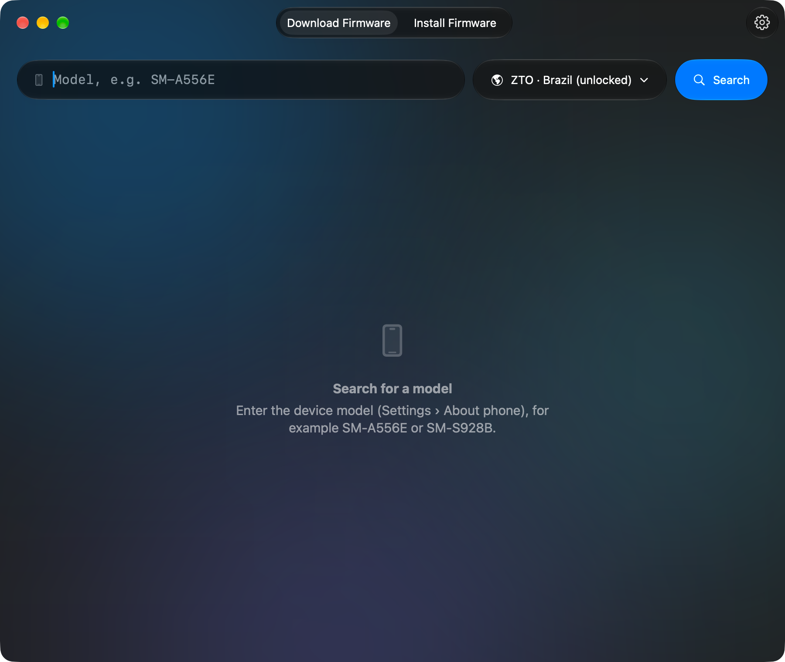
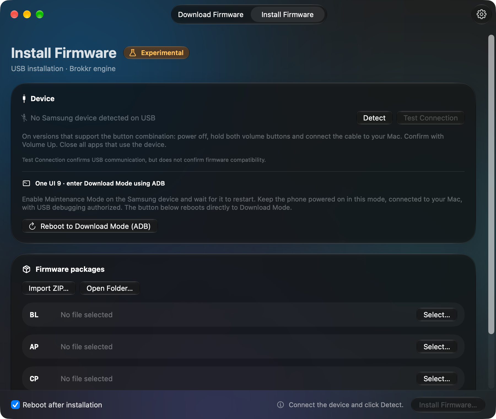

# FirmDrop — download and install Samsung firmware on your Mac

An open source macOS app that **downloads** official Samsung firmware straight from the FUS
(Firmware Update Server) and **installs** it on the device over USB, in Download Mode.
Installation is still experimental.

Downloads are Samsung's official packages, with no modification: the app decrypts the `.enc4`
with the key provided by the server. The downloaded `.zip` can be installed by FirmDrop itself or
used with another flashing tool.

<p align="center">
  
  
</p>

- Search by model and region (Brazil: ZTO, Claro, TIM, Vivo, or any other CSC)
- Shows the marketing name, size, Android version and previous versions with month/year
- **No IMEI required**
- Downloads can be paused and resumed, even after quitting the app
- Checks the **CRC32** and decrypts the `.enc4` automatically
- Keeps the Mac awake while downloading, sends a notification when done
  and shows the download count on the Dock
- Lets you know when a new version of the app is out (GitHub Releases)
- In Portuguese and English, following the macOS language (English for any other language)
- Experimental BL/AP/CP/CSC installation with the [Brokkr](https://github.com/Gabriel2392/brokkr-flash) engine, using native macOS USB, with a connection test, ZIP import and a progress log

Liquid Glass design (floating glass bars and cards, light and dark mode).
Requires **macOS 26** or later.

## Install

1. Download `FirmDrop.dmg` from the latest version on the [Releases page](https://github.com/julianamarques/firmdrop/releases).
2. Open the file and drag **FirmDrop** to **Applications**.

The app tells you when a new version is out. **FirmDrop › Check for Updates…** checks right
away, and **Settings › Updates** chooses whether checks are automatic (when the app opens and
once a day) or manual only. Users on a stable version are not told about pre-releases
(alpha, beta, rc).

The app is only signed locally (*ad-hoc*). On another Mac, macOS blocks the first launch:
allow it in **System Settings › Privacy & Security › Open Anyway**. Distributing without
that warning requires signing and notarizing with an Apple Developer account.

## Build

You need Xcode 26 or later (or the Command Line Tools with Swift 6.2+).

```sh
scripts/build-app.sh             # builds build/FirmDrop.app
scripts/build-app.sh --install   # and copies it to /Applications
scripts/make-dmg.sh              # builds build/FirmDrop.dmg
```

Option for both scripts: `--universal` builds a binary for Apple Silicon and Intel.

The build downloads `auth_param.dat` once (see [below](#auth_paramdat)) and embeds it in the app.
It also downloads `adb` from the Android SDK Platform-Tools (pinned version, checked by SHA-256)
and embeds it with its NOTICE.
It also compiles the installation engine as a separate executable, using pinned revisions
of Brokkr and its dependencies. The first build needs internet access and Git;
it does not need Qt, Homebrew, Heimdall or OdinMac. The engine and its complete sources
ship with the `.app`. See [Engine/README.md](Engine/README.md).

To develop in Xcode, open `Package.swift` (`xed .`) and run the **FirmDrop** scheme.
When it runs outside the `.app`, the app uses `Resources/auth_param.dat`: download it first with
`scripts/fetch-auth-params.sh`.
To test installation with `swift run`, also build the engine once with
`bash scripts/build-flash-engine.sh`; for the ADB button, run `scripts/fetch-adb.sh`.

## Translations

Strings are written in Portuguese in the code, and the translations live in
`Resources/Localizable.xcstrings` (a String Catalog, which can be edited in Xcode). After
adding or changing strings, run:

```sh
scripts/sync-strings.sh   # extracts the strings from the code and updates the catalog
```

New strings show up untranslated in the catalog, and `swift test` fails until every one
has an English version with the same placeholders (`%@`, `%lld`) as the original.

## Publish a release

`scripts/release.sh` updates the version in `Info.plist`, makes the `chore: release vX.Y.Z`
commit, pushes `main`, builds the universal `.dmg` and creates the GitHub Release with notes
taken from the commits since the previous version. It requires an authenticated
[GitHub CLI](https://cli.github.com) and a local `main` that matches `origin/main`.

```sh
DRY_RUN=1 scripts/release.sh 0.1.0-beta.1   # shows the notes without changing anything
scripts/release.sh 0.1.0-beta.1             # pre-release (alpha, beta or rc)
scripts/release.sh 1.0.0                    # stable version
```

The update check uses GitHub's public API, so it only works while the repository is public.

## Usage

1. Type the model, for example `SM-A556E`. It is shown in Settings › About phone;
   suffixes such as `/DS` can stay, the app removes them.
2. Choose the region and click **Search**.
3. Click **Download** on the latest version or on any previous version.

Files go to `~/Downloads`; the folder can be changed in **FirmDrop › Settings** (⌘,).
Settings also let you keep the `.enc4` after decrypting and choose the default region.

### Install firmware from your Mac (experimental)

**Tested on two devices**, all tests on 2026-10-10 and from start to finish:

- **Galaxy S25 (SM-S931B):** One UI 9 (Android 17, `S931BXXUCDZIF`, CSC `OWO`), with the
  full CSC (clean install). The device entered Download Mode through Maintenance Mode
  and ADB.
- **Galaxy A05s (SM-A057M):** One UI 7 (Android 15, `A057MUBUGDZH1`, CSC `OWO`), with the
  full CSC and then with HOME_CSC, which kept the data. The device entered Download Mode
  with the buttons, without ADB.

HOME_CSC follows the package's `meta-data/download-list.txt`: besides `userdata`, it left
out other images, such as `rpm.mbn` and `keymint.mbn`. In the test, the installed version
was the same one already on the device; a version upgrade with HOME_CSC has not been
validated yet. Neither have other models and versions, and the feature remains
experimental.

FirmDrop uses Brokkr's IOKit transport, unlike the Heimdall used by OdinMac.
This makes it possible to investigate the connection with a different implementation, but
does not guarantee a fix when a device is not recognized.

1. Open the **Install Firmware** tab, or click **Install This Firmware…**
   on a completed download.
2. Import the ZIP, open the already extracted folder or select BL, AP, CP and CSC one by one.
   Use all four packages from the same official download. When the ZIP or folder includes both,
   the app does not choose for you: pick in the CSC row between **HOME_CSC**, which tries to
   keep the data, and **CSC**, which wipes the device. You can switch at any time before
   installing. Have a backup in both cases.
3. The app always checks that BL/AP belong to the same version. When the device is rebooted
   over ADB (step 4, only in One UI 9 Maintenance Mode), it also reads the model
   (`ro.product.model`) and checks that the package names match it. This does not
   automatically check CSC, anti-rollback, FRP, Knox or bootloader locks;
   those restrictions are still enforced by the device.
4. On One UI 9, enable **Maintenance Mode** on the Samsung device, wait for it to restart and
   keep the phone powered on in that mode. Connect it to the Mac, authorize USB debugging
   on the device screen and click **Reboot to Download Mode (ADB)**. The app checks
   that maintenance is active, requests the direct reboot and waits up to 45 seconds
   for Download Mode on the same USB port. You don't need to power off from the menu or
   turn off maintenance. On versions that support the button combination, power off
   the phone and hold both volume buttons while connecting the cable; confirm with
   Volume Up. Close all apps that use the device.
5. Click **Detect** and **Test Connection**. Detect only enumerates USB;
   testing opens a protocol session, queries its version and ends without rebooting
   or writing partitions. Installation resumes that session without repeating the handshake,
   like Heimdall's `--resume`. If you need to reconnect the cable, test again;
   if installation fails, leave Download Mode and enter it again before retrying.
6. Click **Install Firmware…** at the bottom of the window. In the review, check the
   files, the model and the bootloader revision, then confirm. Flashing only starts
   after that confirmation. Don't disconnect the cable; the app prevents idle sleep
   and blocks quitting normally while the operation is in progress.

The ADB button uses the `adb` from
[Android SDK Platform-Tools](https://developer.android.com/tools/releases/platform-tools)
included in the app (pinned version, downloaded from Google at build time and checked by SHA-256).
There is nothing to install. The ADB server started by FirmDrop does not use mDNS discovery
on the local network and is stopped after the reboot; a server that was already running
is left alone. For this reboot, connect only one
Samsung device over USB and only one USB device to ADB; Wi-Fi ADB connections are ignored.
The command targets the verified ADB connection, and the device is checked again
before the reboot. Firmware installation remains a separate operation.

If the phone shows **Reboot Device - D2**, it did not stay in Download Mode.
The Maintenance Mode flow with ADB worked on the tested SM-S931B, but that does not establish
compatibility with every model or One UI version.

The engine verifies the MD5 of `.tar.md5` files before the flashing communication. `.tar`
files go through structure validation, but have no MD5 check.
FirmDrop does not send a PIT and does not offer repartitioning, NAND erase, standalone USERDATA,
partial flashing or lock bypasses. Every selected image must match the device's partition
map; otherwise, the operation fails before writing. The session is bound to the chosen USB
connection, with no automatic selection across multiple devices. Flashing cannot be paused
or resumed.

If the device does not show up, try a data cable and a port directly on the Mac and
check the macOS USB accessory authorization. If it shows up but the connection test
fails, copy the log: it tells apart device discovery, exclusive access to the interface
and protocol negotiation. A failure requires a new review and confirmation; there is no
automatic reinstallation attempt.

The ZIP is kept. Extraction creates temporary copies of the selectable packages only;
leave room for those files. They are deleted when the import is replaced or when the app
quits normally. The log also includes the engine's original messages.

### Brazilian regions

| CSC | Region/carrier |
|-----|----------------|
| `ZTO` | Brazil, unlocked (default) |
| `ZTA` | Claro |
| `ZTM` | TIM |
| `ZVV` | Vivo |

All of them serve the same multi-CSC firmware (`OWO`). The active CSC is chosen by the SIM card.

### Disk space

While decrypting, the `.enc4` and the `.zip` exist at the same time, so you need **twice**
the size of the firmware. A flagship such as the S24 Ultra goes over 19 GB.

## How it works

1. **Versions**: `https://fota-cloud-dn.ospserver.net/firmware/{CSC}/{MODEL}/version.xml`
   (public; the CDN only accepts some User-Agents).
2. **Authentication**: `NF_SmartDownloadGenerateNonce.do` returns a nonce. The signature is
   that nonce run through a *white-box* AES cipher extracted from Smart Switch, whose
   tables live in `auth_param.dat` (see below).
3. **BinaryInform**: sends the model, CSC and version; the response has the file name,
   size, CRC32 and `LOGIC_VALUE_FACTORY`, from which the AES key is derived.
4. **BinaryInitForMass** releases the file, which is downloaded from
   `cloud-neofussvr.samsungmobile.com/NF_SmartDownloadBinaryForMass.do` (accepts `Range`).
5. **Decryption**: AES-128-ECB with `MD5(logicCheck(version, LOGIC_VALUE_FACTORY))`.

### `auth_param.dat`

`auth_param.dat` (~800 KB) is embedded in the app, so it works without depending on any
server other than Samsung's. At build time, `scripts/fetch-auth-params.sh` downloads the
file from the [Bifrost](https://github.com/zacharee/SamloaderKotlin) project at a pinned commit
and checks its SHA-256; the app checks it again when loading it. The file is not versioned in
this repository.

If Samsung changes the authentication scheme, searches start failing with
"The server rejected the authentication" (HTTP/status 401). In that case, the commit in
`scripts/fetch-auth-params.sh` and `paramsSHA256` in
`Sources/FirmDropCore/Authenticator.swift` (and possibly the algorithm) need to be updated
following Bifrost, and a new version published.

## Layout

| Path | Contents |
|---|---|
| `Sources/FirmDropCore/` | FUS protocol, authentication, download, package validation and communication with the installation engine |
| `Sources/FirmDrop/` | SwiftUI app: search, downloads, installation, settings |
| `Engine/` | Brokkr GPL adapter, engine patches and reproducible build |
| `Tests/FirmDropCoreTests/` | Tests (`swift test`) |
| `Resources/` | `Info.plist`, app icon and translations (`Localizable.xcstrings`) |
| `scripts/` | `build-app.sh` (assembles the .app), `fetch-auth-params.sh`, `fetch-adb.sh`, `sync-strings.sh`, `make-source-strings.swift`, `make-dmg.sh`, `release.sh` and `make-icon.sh` (generates the icon) |

## Tests

```sh
scripts/fetch-auth-params.sh   # once, for the authentication tests
swift test                     # offline tests
python3 Engine/test-engine.py build/flash-engine/firmdrop-flash # engine, without touching USB
FIRMDROP_LIVE=1 swift test     # includes tests against the real server (downloads ~30 MB)
```

## Limitations

- `version.xml` only lists previous versions that have an OTA update. Others may
  exist on the server, but the app has no way to discover them.
- Use it for your own devices. Redistributing the firmware publicly may violate
  Samsung's terms of use.

## Contributing

Fixes and improvements are welcome. See the [contribution guide](CONTRIBUTING.md). To report vulnerabilities, follow the [security policy](SECURITY.md).

## License

The Swift app is distributed under the [Apache 2.0 license](LICENSE). The separate
installation engine and its adapter are GPL-3.0-or-later. The engine's credits, licenses
and sources are in [NOTICE](NOTICE) and ship with the app in `Contents/Resources/`.

## Credits

Authentication with the FUS server is a port of [Bifrost](https://github.com/zacharee/SamloaderKotlin), by Zachary Wander, under the MIT license (full text in [Resources/licenses/Bifrost-LICENSE.txt](Resources/licenses/Bifrost-LICENSE.txt)). The `auth_param.dat` used for authentication comes from the same project and is embedded in the app.
